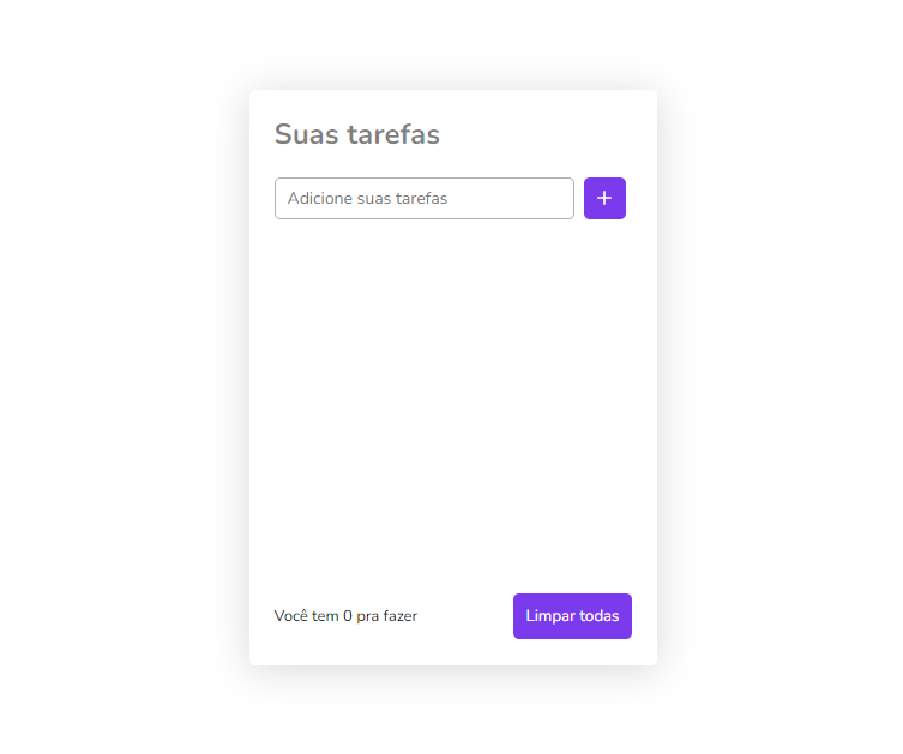

<h1 align="center">
  <strong>to-do</strong>
</h1>
<p align="center">
  <a href="#-projeto">Projeto</a>&nbsp;&nbsp;&nbsp;|&nbsp;&nbsp;&nbsp;
  <a href="#-tecnologias">Tecnologias</a>&nbsp;&nbsp;&nbsp;|&nbsp;&nbsp;&nbsp;
  <a href="#-como-executar">Como executar</a>&nbsp;&nbsp;&nbsp;|&nbsp;&nbsp;&nbsp;
  <a href="#-licença">Licença</a>
</p>
<p align="center">
  
</p>
<br>
<p align="center">
  
</p>

## 💻 Projeto
O to-do é um projeto simples de gerenciamento de tarefas, desenvolvido para ajudar você a manter-se organizado(a) e
produtivo(a) no seu dia a dia. Com esta aplicação, é possível adicionar, marcar como concluídas e remover tarefas de
forma fácil e intuitiva.

O objetivo deste projeto é aprimorar minhas habilidades em React, além de explorar e aprender a utilizar o LocalStorage
como uma ferramenta para armazenar dados localmente no navegador do usuário, uma ferramenta valiosa para criar
experiências de usuário mais ricas e interativas.

## ✨ Tecnologias
Esse projeto foi desenvolvido com as seguintes tecnologias:

- [Vite](https://vitejs.dev/)
- [React](https://reactjs.org)
- [JavaScript](https://developer.mozilla.org/pt-BR/docs/Web/JavaScript)
- [SASS](https://sass-lang.com/)

## 🚀 Como executar
- Clone o repositório
```
git clone https://github.com/dev-bragask/movies.git
```
- Instale as dependências com `npm`

```
npm install
```
- Inicie o servidor com `npm run dev`
```
npm run dev
```

Agora você pode acessar no <a href="http://localhost:5173" target="_blank"
  rel="noopener noreferrer">localhost:5173</a> do seu navegador.

Para ver melhor o projeto acesse esse link: <a href="https://dev-bragask-to-do.vercel.app/" target="_blank"
  rel="noopener noreferrer">https://dev-bragask-to-do.vercel.app/</a>

## 📄 Licença

Esse projeto está sob a licença MIT. Veja o arquivo [LICENSE](LICENSE.md) para mais detalhes.

---
<h3 align="center">Feito com ♥ by Nicolas braga 👋🏻 </h3>